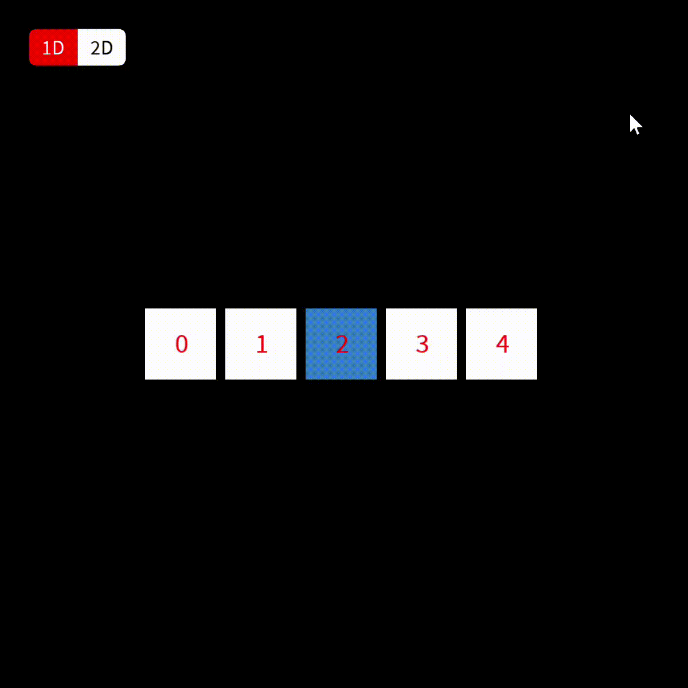

# Matrix Visual Representation
This is a visual representation of a 1D and 2D matrix

<h2> Theory </h2>

  In order to understand how matrices work, we need to first understand the theory behind each individual cell. Each cell has its own individual characteristics. We can better understand a cell by examining its neighbors and seeing how they influence each other.   In a one-dimensional neighborhood, a cell is always surrounded by three cells: the cell itself, the one behind it, and the one in front of it. In a two-dimensional neighborhood, a cell is surrounded by nine cells: the cell itself, the one behind it, the one in front of it, the cell above it, the one below it, and the adjacent cells to the above and below cells.

<h2> Goals </h2>

  The main goal of this project was to create a visual representation of matrix cells' behave in its context.

<h2> How to use </h2>

  Just alternate between the two options of matrix visualization.

 

